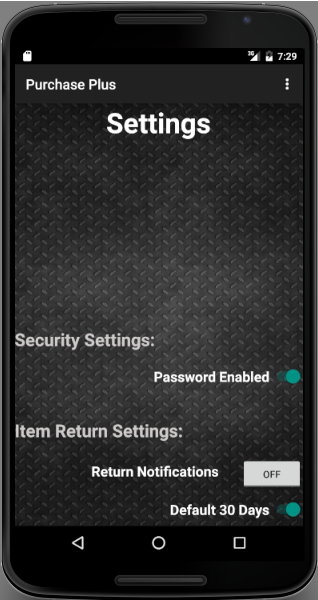

# Purchase Plus
> It provide service for customers to manage their receipts in Android.

### Used Technologies

Java, Android Studio, SQLite  

## Description

It get the reciept data through widgets manually from customer. The reciepts' data is managed in SQLite database which can create and retreive data. It support setting mode and RSS news service. It is not fully developed but it is valuable as prototype for future android projects.

## Screen Shot




## Installation

Windows:

```sh

```

## Usage example

## Development setup